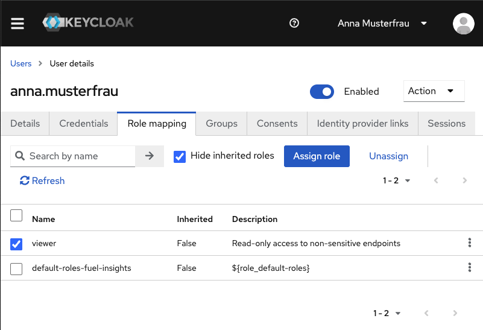

# **Fuel Insights Platform**  
*A cloud‑native platform for monitoring heating oil, diesel, and gasoline consumption with IAM, DevOps, and observability.*

## **Overview**
The Fuel Insights Platform is a compact but production‑style project designed to demonstrate modern DevOps, CloudOps, and IAM practices.  
It integrates:

- A secure API protected by **Keycloak IAM**
- Deployment on **Kubernetes** (local + AWS)
- **GitOps** workflows using ArgoCD
- Full **observability** with Prometheus, Grafana, and Loki
- Real fuel‑consumption data (heating oil, diesel, gasoline)
- Optional external price integration

## **Intended Use**
This project is built for **private household fuel analysis**.  
It helps consumers monitor heating oil, diesel, or gasoline usage and understand their own consumption patterns.

The architecture is intentionally flexible and can be extended later to support additional use cases, such as **agricultural fuel storage** or small‑scale diesel tank monitoring.

---

## **Features**
- 🔐 **Identity & Access Management** with Keycloak  
- 🧪 **FastAPI service** with JWT‑protected endpoints  
- 📊 **Monitoring & Logging** via Prometheus, Grafana, Loki  
- 🚀 **Kubernetes deployment** (local + AWS)  
- 🔄 **GitOps** with ArgoCD  
- ☁️ **AWS‑ready** (EC2, S3, CloudWatch)  
- ⛽ **Multi‑fuel analytics** (heating oil, diesel, gasoline)

---

## **Architecture**

## **Architecture Diagram**

## **Architecture Diagram**

```text
          +---------------------------+
          |        Keycloak IAM       |
          |   Realm: fuel-insights    |
          +-------------+-------------+
                        |
                        | JWT / OIDC
                        v
              +----------------------+
              |      FastAPI API     |
              |  /fuel/* endpoints   |
              +----------+-----------+
                         |
             Metrics & Logs to Stack
                         |
        +---------+  +---------+  +--------+
        |Prometheus| | Grafana | |  Loki  |
        +---------+  +---------+  +--------+

          +---------------------------+
          |     Kubernetes Cluster    |
          |  (local / AWS, GitOps)    |
          +---------------------------+


The platform consists of:

- **API Service**  
  FastAPI application exposing fuel history, consumption, and price endpoints.

- **Keycloak IAM**  
  Realm, clients, and roles for secure access control.

- **Kubernetes Deployment**  
  Manifests for API, Keycloak, ingress, and monitoring stack.

- **Observability Stack**  
  Prometheus for metrics, Grafana dashboards, Loki logs.

- **GitOps**  
  ArgoCD manages deployments from this repository.

- **AWS Integration (optional)**  
  EC2 + k3s cluster, S3 storage, CloudWatch logs.

---

## **Repository Structure**
```
api/                # FastAPI application
data/               # Fuel datasets (converted from Excel)
docs/               # Architecture, IAM design, AWS deployment
keycloak/           # Realm export, clients, roles
k8s/                # Kubernetes manifests (base + overlays)
monitoring/         # Prometheus, Grafana, Loki configs
argocd/             # GitOps application definitions
```

---

## 🔐 IAM Demo: User Login & Role‑Based Access Control

The platform includes a complete Identity & Access Management setup using **Keycloak**, demonstrating both machine‑to‑machine authentication and interactive user login.

### **User Login Flow**
A demo user (`anna.musterfrau`) is created inside the `fuel-insights` realm to showcase the standard OIDC Authorization Code Flow.

The login screen below shows a successful authentication attempt using a real Keycloak login page:

### Realm Welcome Screen


### **Realm Roles**
The following realm roles are defined to support fine‑grained access control:

| Role        | Description                                      |
|-------------|--------------------------------------------------|
| `viewer`    | Read‑only access to non‑sensitive API endpoints  |
| `fuel-user` | Standard access to fuel‑related API operations   |
| `admin`     | Full administrative access to the Fuel API       |

These roles are assigned to users and service accounts to enforce RBAC across the platform.

### User Role Mapping


### **Token Inspection**
After login, the user receives a JWT containing:

- `preferred_username`
- `realm_access.roles`
- `exp`, `iat`, `iss`
- Optional custom claims

This token is then used to access protected FastAPI endpoints.

### **API Access Example**
- A `viewer` can access read‑only endpoints such as `/fuel/history`
- An `admin` can access management endpoints such as `/fuel/refill` or `/fuel/config`
- Unauthorized roles receive a `403 Forbidden` response

This demonstrates a clean, production‑style IAM integration suitable for DevOps, CloudOps, and security‑focused environments.

## **Local Development**
Local environment uses:

- Docker
- kind/k3d Kubernetes cluster
- Keycloak container
- Prometheus + Grafana + Loki stack

---

## **AWS Deployment**
The platform can be deployed on AWS using:

- EC2 (Free Tier)
- k3s cluster
- S3 for data storage
- CloudWatch for logs
- IAM roles for service access

---

## **Next Steps**

The platform is intentionally designed to evolve. Future enhancements may include:

### **1. ML‑Based Consumption Forecasting**
- Predict daily and monthly fuel usage
- Detect seasonal patterns (winter vs. summer)
- Estimate time‑to‑empty and optimal refill windows
- Provide cost projections based on price trends

### **2. Multi‑Household Support**
- Allow multiple households to submit tank measurements
- Compare consumption patterns across users
- Enable community‑based forecasting models
- Support different tank types and sizes

### **3. IoT Sensor Integration**
- Connect ultrasonic or pressure‑based tank sensors
- Stream real‑time tank levels into the API
- Trigger alerts for low levels or abnormal consumption
- Enable fully automated monitoring

### **4. Extended Fuel Types**
- Agricultural diesel tanks
- Generator fuel storage
- Fleet vehicle fuel tracking

### **5. Frontend Dashboard**
- Web UI for tank levels, consumption, and predictions
- Role‑based access (viewer, admin)
- Real‑time charts powered by Grafana or custom UI

These steps transform the platform from a personal tool into a scalable, cloud‑native fuel analytics system suitable for households, agriculture, or industrial use.

## **Status**
This project is under active development.

